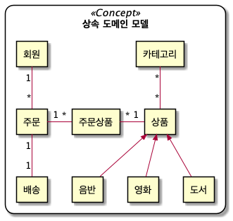
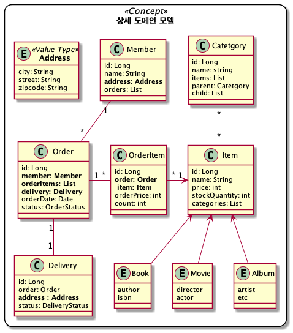
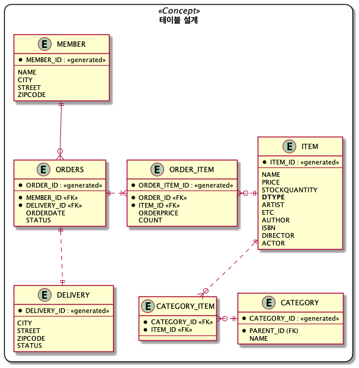

# 스프링 부트와 JPA을 활용한 쇼핑몰 웹앱 개발

---
## 1. 프로젝트 환경설정

 > [스프링 부트 스타터](https://start.spring.io/)로 프로젝트 생성
  - 자바 버젼 : 11
  - 스프링프레임워크 : 2.6.3
  - 핵심 라이브러리 : 스프링 MVC, 스프링ORM, JPA, 하이버네이트 , 스프링데이터 JPA
  - 기타 라이브러리 : H2, 커넥션풀:HicariCP, Thymeleaf, 로깅(SLF4J & LogBack)
  - 테스트 라이브러리 : junit, mockito, assertj, spring-test
  - 의존성관리 : gradle 7.3.3

 > 라이브러리 상세

 * spring-boot-starter-web
   - spring-boot-starter-tomcat: 톰캣 (웹서버)
   - spring-boot-starter-thymeleaf: 타임리프 템플릿 엔진(View)
 * spring-boot-starter-data-jpa
 * spring-boot-starter-aop
   - spring-boot-starter-jdbc
   - HikariCP 커넥션 풀 (부트 2.0 기본)
   - hibernate + JPA: 하이버네이트 + JPA
   - spring-data-jpa: 스프링 데이터 JPA
 * spring-boot-starter(공통): 스프링 부트 + 스프링 코어 + 로깅
   - spring-boot
   - spring-core
   - spring-boot-starter-logging
   - logback, slf4j
 * spring-boot-starter-test
   - junit: 테스트 프레임워크
   - mockito: 목 라이브러리
   - assertj: 테스트 코드를 좀 더 편하게 작성하게 도와주는 라이브러리
   - spring-test: 스프링 통합 테스트 지원

> SQL실행 파라미터를 로그로 남기기
* 다음 [외부 라이브러리](https://github.com/gavlyukovskiy/spring-boot-data-source-decorator) 추가
 - `implementation 'com.github.gavlyukovskiy:p6spy-spring-boot-starter:1.8.0'`
 - 주의 : 운영 환경에서는 성능 이슈가 있을 수 있기 때문에 제외한다.

---

## 2. 도메인 분석 설계

### 2.1 요구사항 분석

>  기능목록

 - 회원 기능 : 등록, 조회
 - 상품 기능 : 등록, 조회, 수정
 - 주문 기능 : 상품 주문, 주문 조회, 주문 취소
 - 요구 사항 :
   - 상품은 재고 관리가 필요
   - 상품을 카테고리로 구분 (도서, 음반, 영화) 
   - 상품 주문시 배송정보 입력
 
### 2.2 도메인 모델
---

---

> 아래는 예제를 위한 설계로 실무 에서는 주의 해야 한다.
 - 카테고리와 아이템의 경우 다대다 이지만 실무 에서는 사용하지 않는다.
 - 회원정보의 주문리스트도 실무에서는 사용하지 않는다.
 - 실무에서 다대다는 엔티티 또는 관계형 디비로 풀어내기에는 복잡해서 사용하지 않는다.
---

---
- 주문, 상품의 관계
  - 회원은 한번 주문에 여러 상품을 선택할 수 있으므로 다대다 관계이다.
  - 다대다는 주문상품이라는 엔티티를 추가해서 일대다 관계로 풀어냈다.
- 카테고리와 상품의 관계
  - 객체는 다대다를 구현할 수 있지만 관계형 디비에서는 불가능하기 때문에 중간에 매핑 테이블을 추가했다.

- 상품 분류 : 공통속성을 사용하므로 상속구조로 표현 

---

## 3. 어플리케이션 구현

### 3.1 회원 도메인 개발
> 리포지토리 개발

> 서비스 개발 

> 기능 테스트 

---
### 3.2 상품 도메인 개발
> 비지니스 로직 추가

> 리포지토리 개발

> 서비스 개발

---
### 3.3 주문 도메인 개발
> 주문,상품 엔티티 개발

> 리포지토리 개발 

> 서비스 개발

> 기능 테스트

> 검색 기능 개발

---
### 3.4 웹 계층 개발

> 레이아웃

> 회원 등록 & 조회

> 상품 조회 & 등록 & 수정

> 변경 감지와 병합

> 상품 주문

> 주문 검색 & 취소

